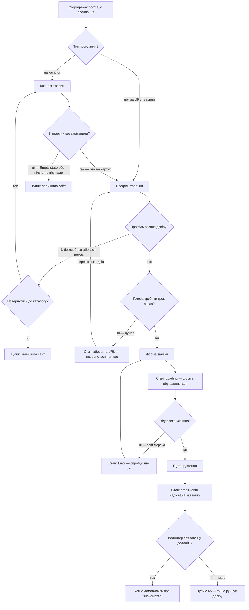
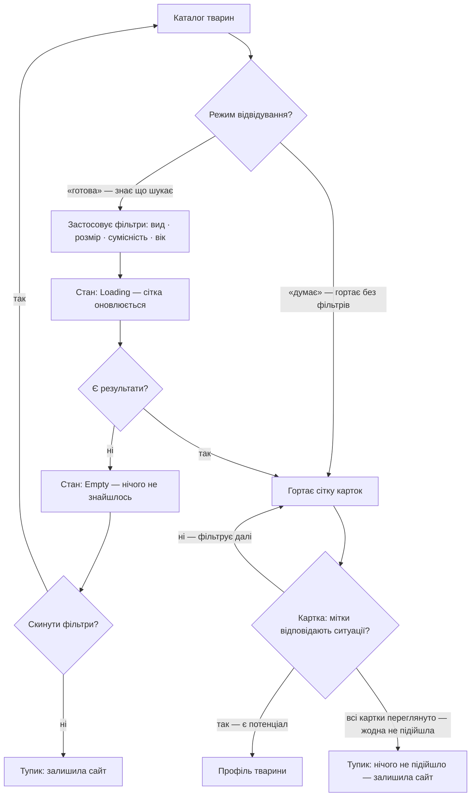
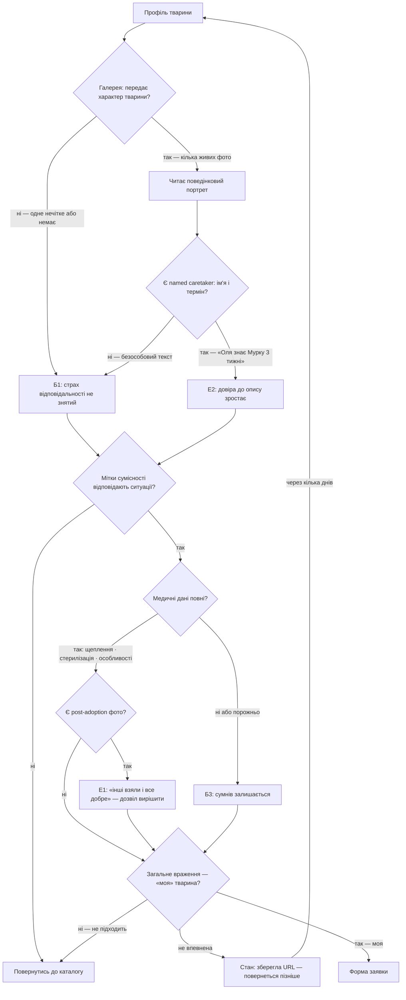
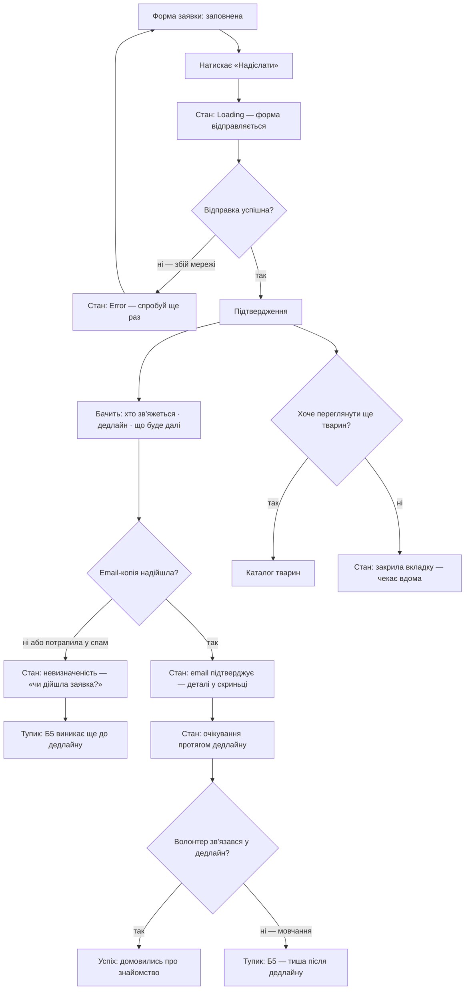

# Prytulok — User Flows

> Flows виведено з jobs (jtbd.md). Кожен вузол-екран існує в sitemap.md.
> «Стан:» — стан існуючого екрана, не новий екран.
> «Тупик:» — місце де людина може залишити продукт.

---

## MAIN JOB — відповідь «моя / не моя» без дзвінків

> Primary-персона П1 (Маша). Два входи: через каталог і через пряме посилання.
> Охоплює весь флоу від першого торкання до підтвердження заявки.

**Рішення і стани:**

| Вузол | Тип | Чому важливий |
|---|---|---|
| Стан: Empty — нічого не знайшлось | Empty state каталогу | Без явного «скинути фільтри» → guaranteed dead end |
| Стан: зберегла URL | Пауза між сесіями | Механізм R5; людина повертається без жодного кліку по навігації |
| Стан: Loading | Перехідний стан форми | Без нього людина натисне «надіслати» двічі |
| Стан: Error | Стан форми після збою | Має зберігати введені дані — не скидати форму |
| Тупик Б5 | Поза продуктом | Виникає лише якщо R4 не виконано. Якщо дедлайн чіткий — людина чекає усвідомлено |

---

## R1 — Швидке сортування

> Zoom in: Каталог тварин. Ціль — відсіяти «не моє» до кліку на профіль.
> Персони: П1 (primary), П2, П3.

**Рішення і стани:**

| Вузол | Тип | Чому важливий |
|---|---|---|
| Застосовує фільтри | Дія | Якщо фільтр дає 0 результатів без підказки → Dead1 гарантований |
| Стан: Empty після фільтрів | Empty state | Потрібен CTA «Показати всіх» поряд — не лише текст «нічого не знайдено» |
| Картка: мітки відповідають? | Рішення в сітці | Без compatibility-міток на картці ця точка рішення переноситься всередину профілю — і клікати доведеться на кожну тварину |
| Тупик «всі переглянуто» | Виснаження каталогу | При базі 20–60 тварин — реальний стан. Пом'якшується нотаткою «нові тварини щотижня» |

---

## R2 — Зрозуміти тварину як живу істоту

> Zoom in: Профіль тварини. Ціль — побудувати або зруйнувати довіру до конкретної тварини.
> Персони: П1 (primary), П3.

**Рішення і стани:**

| Вузол | Тип | Чому важливий |
|---|---|---|
| LowTrust | Проміжний стан | Не тупик сам по собі: людина може читати далі. Але LowTrust + CompatQ=«ні» = відхід |
| Named caretaker | Ключова розвилка | Різниця К2=5 (RSPCA) vs К2=2–3 (UA) — не обсяг тексту, а авторитетність підпису |
| E1: post-adoption фото | Підсилювач рішення | Служить E1 (дозвіл вирішити), не R2 напряму. З'являється наприкінці R2-потоку |
| Стан: зберегла URL | Пауза | Виникає після глибокого читання, не тільки після першого погляду на сітку |

---

## R4 — Знати що буде після

> Zoom in: Форма заявки → Підтвердження → очікування.
> Ціль — замінити Б5 (тиша і невизначеність) конкретним дедлайном.
> Персони: П1 (primary), П2.

**Рішення і стани:**

| Вузол | Тип | Чому важливий |
|---|---|---|
| Стан: Loading | Перехідний | Кнопка «Надіслати» має блокуватись — інакше подвійна відправка |
| Стан: Error | Стан форми | Дані не скидати; показати яке поле спричинило збій |
| Email-копія не надійшла | Ранній Б5 | Сторінка підтвердження бачиться один раз. Email — єдиний референс після закриття вкладки |
| Стан: очікування | Поза продуктом | Продукт контролює лише очікування: дедлайн перетворює тривогу на конкретний горизонт |
| Тупик Б5 після дедлайну | Поза продуктом | Продукт не може змусити волонтера зателефонувати, але може зробити так що людина знає «до якого числа» |
| Переглянути ще тварин | Глибока дія | Більшість закриють вкладку. Посилання на каталог — для тих хто подає заявки паралельно |

---

## Нові екрани в sitemap.md: відсутні

Всі вузли-екрани у flows вже існують у sitemap.md:
- `Каталог тварин` → `/`
- `Профіль тварини` → `/[тварина]`
- `Форма заявки` → `/[тварина]/заявка`
- `Підтвердження` → `/[тварина]/заявка/дякуємо`
- `Каталог тварин` (повторне посилання) → той самий екран

Стани (Empty, Error, Loading, URLSave, Wait) — стани існуючих екранів, не нові маршрути.
